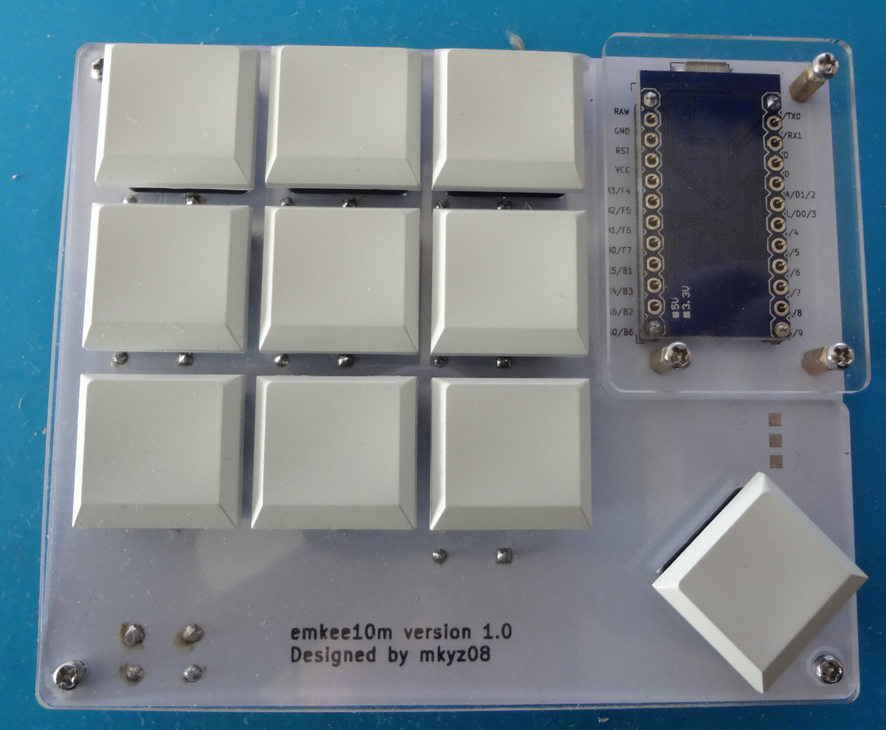
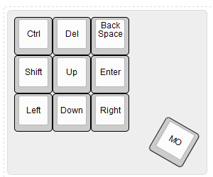

# emkee10m

## 説明

自作キーボードの勉強用に作成したキーボード。
3x3列 + 1キーで、右下の1キーはレイヤーキー。



## Parts

- PCB：1個
- ボトムプレート：1個
- トッププレート：1個
- キースイッチ（MX or Choc）：10個
- キーキャップ 1U：10個
- Pro Micro：1個
- ダイオード　1N4148：10個
- タクトスイッチ　MJ-4PP-9：1個
- Underglow LED　WS2812（オプション）：1つ
- マイクロUSBケーブル：1本
- M2ネジ(8mm)：12個
- M2スペーサ(4mm)：9個
- ゴム足：4個


## ファームウェア


```
make emkee10m:default:avrdude
```


## デフォルトキー配列




## ビルドログ

- ダイオードの実装
- タクトスイッチの実装
- Pro Microヘッダーピンの実装
- トッププレートにスイッチに嵌める
- キーキャップを嵌める
- Pro Micro にファームウェアを書き込む


## リリースノート

- v1.0
   - 初版リリース。
- v1.1
  - スイッチの取付位置を裏から表に変更
  - Pro MicroのUSB取り付けに余裕がなかったため、外側へ移動（数mm）程度
  - PCBのM2ねじ用のMHを大きく変更

※v1.1はPCBを修正していますが、組み立ては行っていませんので誤りが含まれている可能性があります。